# AI-DLC Adaptive Workflow Overview

**Purpose**: Technical reference for AI model and developers to understand complete workflow structure.

**Note**: Similar content exists in core-workflow.md (user welcome message) and README.md (documentation). This duplication is INTENTIONAL - each file serves a different purpose:
- **This file**: Detailed technical reference with Mermaid diagram for AI model context loading
- **core-workflow.md**: User-facing welcome message with ASCII diagram
- **README.md**: Human-readable documentation for repository

## The Five-Phase Lifecycle:
• **INCEPTION PHASE**: Planning and architecture (Workspace Detection + conditional phases + Workflow Planning)
• **CONSTRUCTION PHASE**: Design, implementation, build and test (per-unit design + Code Planning/Generation + Build & Test)
• **OPERATIONS PHASE**: Placeholder for future deployment and monitoring workflows
• **TESTING & VALIDATION PHASE**: System integration testing, regression, contract validation, coverage reporting
• **DOCUMENTATION & CONSOLIDATION PHASE**: Feature docs, impact scan, cross-doc updates, consistency check, backlog update

## The Adaptive Workflow:
• **Workspace Detection** (always) → **Reverse Engineering** (brownfield only) → **Requirements Analysis** (always, adaptive depth) → **Conditional Phases** (as needed) → **Workflow Planning** (always) → **Code Generation** (always, per-unit) → **Build and Test** (always)

## How It Works:
• **AI analyzes** your request, workspace, and complexity to determine which stages are needed
• **These stages always execute**: Workspace Detection, Requirements Analysis (adaptive depth), Workflow Planning, Code Generation (per-unit), Build and Test
• **All other stages are conditional**: Reverse Engineering, User Stories, Application Design, Units Generation, per-unit design stages (Functional Design, NFR Requirements, NFR Design, Infrastructure Design)
• **No fixed sequences**: Stages execute in the order that makes sense for your specific task

## Your Team's Role:
• **Answer questions** in dedicated question files using [Answer]: tags with letter choices (A, B, C, D, E)
• **Option E available**: Choose "Other" and describe your custom response if provided options don't match
• **Work as a team** to review and approve each phase before proceeding
• **Collectively decide** on architectural approach when needed
• **Important**: This is a team effort - involve relevant stakeholders for each phase

## AI-DLC Five-Phase Workflow:

```mermaid
flowchart TD
    Start(["User Request:<br/>Using AI-DLC, ..."])

    subgraph ACTIVATION["⚡ WORKFLOW ACTIVATION"]
        TS["Track Selection<br/><b>ALWAYS FIRST</b>"]
    end

    subgraph INCEPTION["🔵 INCEPTION PHASE"]
        WD["Workspace Detection<br/><b>ALWAYS</b>"]
        RE["Reverse Engineering<br/><b>CONDITIONAL</b>"]
        RA["Requirements Analysis<br/><b>ALWAYS</b>"]
        Stories["User Stories<br/><b>CONDITIONAL</b>"]
        WP["Workflow Planning<br/><b>ALWAYS</b>"]
        AppDesign["Application Design<br/><b>CONDITIONAL</b>"]
        UnitsG["Units Generation<br/><b>CONDITIONAL</b>"]
    end

    subgraph CONSTRUCTION["🟢 CONSTRUCTION PHASE"]
        FD["Functional Design<br/><b>CONDITIONAL</b>"]
        NFRA["NFR Requirements<br/><b>CONDITIONAL</b>"]
        NFRD["NFR Design<br/><b>CONDITIONAL</b>"]
        ID["Infrastructure Design<br/><b>CONDITIONAL</b>"]
        CG["Code Generation<br/><b>ALWAYS</b>"]
        BT["Build and Test<br/><b>ALWAYS</b>"]
    end

    subgraph OPERATIONS["🟡 OPERATIONS PHASE"]
        OPS["Operations<br/><b>PLACEHOLDER</b>"]
    end

    subgraph TESTING["🟠 TESTING & VALIDATION PHASE"]
        ITG["Integration Test Generation<br/><b>ALWAYS</b>"]
        RR["Regression Run<br/><b>ALWAYS</b>"]
        CV["Contract Validation<br/><b>CONDITIONAL</b>"]
        CR["Coverage Report<br/><b>ALWAYS</b>"]
        TApproval{{"Human Approval Gate"}}
    end

    subgraph DOCUMENTATION["🟣 DOCUMENTATION & CONSOLIDATION PHASE"]
        FDoc["Feature Documentation<br/><b>ALWAYS</b>"]
        IS["Impact Scan<br/><b>ALWAYS</b>"]
        CDU["Cross-Doc Update<br/><b>CONDITIONAL</b>"]
        CC["Consistency Check<br/><b>ALWAYS</b>"]
        BU["Backlog Update<br/><b>ALWAYS</b>"]
        DApproval{{"Human Approval Gate"}}
    end

    Start --> TS
    TS --> WD
    WD -.-> RE
    WD --> RA
    RE --> RA

    RA -.-> Stories
    RA --> WP
    Stories --> WP

    WP -.-> AppDesign
    WP -.-> UnitsG
    AppDesign -.-> UnitsG
    UnitsG --> FD
    FD -.-> NFRA
    NFRA -.-> NFRD
    NFRD -.-> ID

    WP --> CG
    FD --> CG
    NFRA --> CG
    NFRD --> CG
    ID --> CG
    CG -.->|Next Unit| FD
    CG --> BT
    BT -.-> OPS
    OPS -.-> ITG
    BT --> ITG
    ITG --> RR
    RR -.-> CV
    RR --> CR
    CV --> CR
    CR --> TApproval
    TApproval --> FDoc
    FDoc --> IS
    IS -.-> CDU
    IS --> CC
    CDU --> CC
    CC --> BU
    BU --> DApproval
    DApproval --> End(["Complete"])

    style WD fill:#4CAF50,stroke:#1B5E20,stroke-width:3px,color:#fff
    style RA fill:#4CAF50,stroke:#1B5E20,stroke-width:3px,color:#fff
    style WP fill:#4CAF50,stroke:#1B5E20,stroke-width:3px,color:#fff
    style CG fill:#4CAF50,stroke:#1B5E20,stroke-width:3px,color:#fff
    style BT fill:#4CAF50,stroke:#1B5E20,stroke-width:3px,color:#fff
    style OPS fill:#BDBDBD,stroke:#424242,stroke-width:2px,stroke-dasharray: 5 5,color:#000
    style RE fill:#FFA726,stroke:#E65100,stroke-width:3px,stroke-dasharray: 5 5,color:#000
    style Stories fill:#FFA726,stroke:#E65100,stroke-width:3px,stroke-dasharray: 5 5,color:#000
    style AppDesign fill:#FFA726,stroke:#E65100,stroke-width:3px,stroke-dasharray: 5 5,color:#000
    style UnitsG fill:#FFA726,stroke:#E65100,stroke-width:3px,stroke-dasharray: 5 5,color:#000
    style FD fill:#FFA726,stroke:#E65100,stroke-width:3px,stroke-dasharray: 5 5,color:#000
    style NFRA fill:#FFA726,stroke:#E65100,stroke-width:3px,stroke-dasharray: 5 5,color:#000
    style NFRD fill:#FFA726,stroke:#E65100,stroke-width:3px,stroke-dasharray: 5 5,color:#000
    style ID fill:#FFA726,stroke:#E65100,stroke-width:3px,stroke-dasharray: 5 5,color:#000
    style ITG fill:#4CAF50,stroke:#1B5E20,stroke-width:3px,color:#fff
    style RR fill:#4CAF50,stroke:#1B5E20,stroke-width:3px,color:#fff
    style CV fill:#FFA726,stroke:#E65100,stroke-width:3px,stroke-dasharray: 5 5,color:#000
    style CR fill:#4CAF50,stroke:#1B5E20,stroke-width:3px,color:#fff
    style TApproval fill:#F44336,stroke:#B71C1C,stroke-width:3px,color:#fff
    style FDoc fill:#4CAF50,stroke:#1B5E20,stroke-width:3px,color:#fff
    style IS fill:#4CAF50,stroke:#1B5E20,stroke-width:3px,color:#fff
    style CDU fill:#FFA726,stroke:#E65100,stroke-width:3px,stroke-dasharray: 5 5,color:#000
    style CC fill:#4CAF50,stroke:#1B5E20,stroke-width:3px,color:#fff
    style BU fill:#4CAF50,stroke:#1B5E20,stroke-width:3px,color:#fff
    style DApproval fill:#F44336,stroke:#B71C1C,stroke-width:3px,color:#fff
    style INCEPTION fill:#BBDEFB,stroke:#1565C0,stroke-width:3px,color:#000
    style CONSTRUCTION fill:#C8E6C9,stroke:#2E7D32,stroke-width:3px,color:#000
    style OPERATIONS fill:#FFF59D,stroke:#F57F17,stroke-width:3px,color:#000
    style TESTING fill:#FFCCBC,stroke:#E64A19,stroke-width:3px,color:#000
    style DOCUMENTATION fill:#E1BEE7,stroke:#7B1FA2,stroke-width:3px,color:#000
    style Start fill:#CE93D8,stroke:#6A1B9A,stroke-width:3px,color:#000
    style End fill:#CE93D8,stroke:#6A1B9A,stroke-width:3px,color:#000
    style TS fill:#9C27B0,stroke:#4A148C,stroke-width:3px,color:#fff
    style ACTIVATION fill:#F3E5F5,stroke:#7B1FA2,stroke-width:3px,color:#000

    linkStyle default stroke:#333,stroke-width:2px
```

**Stage Descriptions:**

**⚡ WORKFLOW ACTIVATION** - First Step After Trigger
- Track Selection: Analyze activation prompt and select Full/Lightweight/Hotfix track (ALWAYS FIRST)
  - Based on signal words in the prompt (new feature → Full, improvement → Lightweight, bug fix → Hotfix)
  - Announces selection with rationale and waits for confirmation
  - Must complete before Inception begins

**🔵 INCEPTION PHASE** - Planning and Architecture
- Workspace Detection: Analyze workspace state and project type (ALWAYS)
- Reverse Engineering: Analyze existing codebase (CONDITIONAL - Brownfield only)
- Requirements Analysis: Gather and validate requirements (ALWAYS - Adaptive depth)
- User Stories: Create user stories and personas (CONDITIONAL)
- Workflow Planning: Create execution plan (ALWAYS)
- Application Design: High-level component identification and service layer design (CONDITIONAL)
- Units Generation: Decompose into units of work (CONDITIONAL)

**🟢 CONSTRUCTION PHASE** - Design, Implementation, Build and Test
- Functional Design: Detailed business logic design per unit (CONDITIONAL, per-unit)
- NFR Requirements: Determine NFRs and select tech stack (CONDITIONAL, per-unit)
- NFR Design: Incorporate NFR patterns and logical components (CONDITIONAL, per-unit)
- Infrastructure Design: Map to actual infrastructure services (CONDITIONAL, per-unit)
- Code Generation: Generate code with Part 1 - Planning, Part 2 - Generation (ALWAYS, per-unit)
- Build and Test: Build all units and execute comprehensive testing (ALWAYS)

**🟡 OPERATIONS PHASE** - Placeholder
- Operations: Placeholder for future deployment and monitoring workflows (PLACEHOLDER)

**🟠 TESTING & VALIDATION PHASE** - System Integration Testing
- Integration Test Generation: Generate tests that probe cross-domain touch points (ALWAYS)
- Regression Run: Execute full existing test suite, surface failures introduced by this unit (ALWAYS)
- Contract Validation: Verify API implementation matches spec, tool schemas match consumers (CONDITIONAL)
- Coverage Report: Structured report of untested code paths with risk notes (ALWAYS)
- Human Approval Gate: Developer reviews full testing report before Documentation phase

**🟣 DOCUMENTATION & CONSOLIDATION PHASE** - Capture What Was Built
- Feature Documentation: Generate comprehensive feature doc for the unit (ALWAYS)
- Impact Scan: Identify all existing docs referencing affected components (ALWAYS)
- Cross-Doc Update: Update every file identified in impact scan (CONDITIONAL)
- Consistency Check: Verify terminology, version references, code examples are consistent (ALWAYS)
- Backlog Update: Mark unit complete, update unblocked units, write completion note (ALWAYS)
- Human Approval Gate: Developer reviews and confirms doc updates, closes unit of work

**Key Principles:**
- Phases execute only when they add value
- Each phase independently evaluated
- INCEPTION focuses on "what" and "why"
- CONSTRUCTION focuses on "how" plus "build and test"
- OPERATIONS is placeholder for future expansion
- TESTING & VALIDATION focuses on "does it work with everything else?"
- DOCUMENTATION & CONSOLIDATION focuses on "is it documented correctly?"
- Human approval gates required between Testing & Validation → Documentation, and at workflow close
- Documentation is the mandatory exit condition for ALL workflow tracks
- Simple changes may skip conditional INCEPTION stages
- Complex changes get full treatment across all five phases