# Orbit AI-DLC

> A comprehensive, structured AI-assisted development lifecycle framework adapted from AWS AI-DLC v0.1.5.

**Based on**: [awslabs/aidlc-workflows](https://github.com/awslabs/aidlc-workflows) v0.1.5 (MIT-0 License)
**Target Tools**: Claude Code
**Optimized for**: Solo developers and small teams on greenfield and brownfield projects with planning documentation

---

## What is Orbit AI-DLC?

Orbit AI-DLC is a framework that guides AI coding assistants through a structured software development lifecycle. Instead of ad-hoc prompting, the AI follows a disciplined workflow with:

- **Five distinct phases** from planning to documentation
- **Human-in-the-loop approval gates** at every major transition
- **Session continuity** — seamlessly resume work across sessions
- **Task alignment verification** — ensures the AI stays on track with your original request
- **Automatic documentation** — every unit of work is documented before completion

---

## Brownfield Planning Doc Intelligence

**New in this version**: AI-DLC now intelligently detects and leverages existing **planning documentation** for brownfield projects, eliminating redundant re-planning work.

**What this means for you**:

- If you have existing planning docs (architecture docs, design specs, technical overviews), AI-DLC will automatically detect them
- Technical stack is auto-extracted from your planning docs (frameworks, databases, languages)
- Domains are auto-detected from your doc structure and naming patterns
- Requirements are extracted from planning docs instead of asking from scratch
- **Result**: 30-90 minutes saved per project initialization

**Scope**: This brownfield support is specifically for **planning documentation** (markdown files with architecture, design, requirements). It is NOT full codebase reverse engineering or automatic code scanning. If you have an existing codebase without planning docs, you'll need to create planning documentation first or use the greenfield flow.

**Example**: Project with 27 planning docs (36K lines) goes from "I want to organize my docs" to "Ready to implement" in 5-10 minutes instead of 60-90 minutes.

### The Honest Bottom Line

| Aspect                                         | Assessment                                                                              |
| ---------------------------------------------- | --------------------------------------------------------------------------------------- |
| **Will it understand your codebase?**          | Partially. Large codebases exceed what can be analyzed in one pass.                     |
| **Will it modify existing files chaotically?** | No. All modifications require explicit approval and show exact file lists.              |
| **Is initialization required?**                | Yes, but it's quick (5-10 min).                                                         |
| **Is it safe to try?**                         | Yes. Worst case: you delete `aidlc-docs/` and nothing else is affected.                 |
| **Best for brownfield?**                       | Works better when you have existing docs. Struggles more with undocumented legacy code. |

The framework is **conservative by design** — it asks before acting, shows plans before executing, and isolates its artifacts. The risk isn't chaos; it's that the AI might not understand your codebase well enough to generate _useful_ new code on the first try.

### Knowledge Base Promotion (Preventing Documentation Drift)

For brownfield projects with an existing `docs/` folder, AI-DLC creates feature documentation in `aidlc-docs/{domain}/{unit}/` during development. This separation keeps workflow artifacts isolated, but over time can lead to documentation drift between your knowledge base and feature docs.

**Solution**: At the end of each Full or Lightweight track unit, AI-DLC offers to **promote** feature documentation to your knowledge base:

| Option             | What It Does                                                                            |
| ------------------ | --------------------------------------------------------------------------------------- |
| **Skip** (default) | Keep feature-doc in `aidlc-docs/` only — current behavior preserved                     |
| **Copy**           | Copy feature-doc to `{knowledge_base}/features/{UNIT-ID}.md`                            |
| **Merge**          | Guided merge of relevant sections into existing docs (API reference, data models, etc.) |
| **Link**           | Add reference links in relevant docs pointing to feature-doc                            |

**Configure defaults**: Set your preferred behavior in `aidlc-docs/anchor-map.md` under `## Knowledge Base Promotion Preference` to avoid repeated prompts:

```markdown
## Knowledge Base Promotion Preference (Optional)

- **Default Action**: merge
- **Features Directory**: docs/features
```

**Note**: Hotfix track uses a lightweight impact check instead — it flags potentially affected knowledge base docs without requiring full promotion (hotfix docs are typically too lightweight to warrant promotion).

---

## Quick Start

1. Download the latest release zip from the [Releases](https://github.com/PyxisSoftwareOrg/csiorbit-aidlc/releases) page to a folder outside your project directory (e.g., `~/Downloads`)
2. Extract the zip. It contains:
   - `CLAUDE.md` — the core AI-DLC workflow
   - `.aidlc-rule-details/` — detailed rules conditionally referenced by the core workflow
   - `.claude/` — Claude Code skills and agents for developer productivity
   - `CLAUDE-TEAMS.md` + `.aidlc-rule-details-teams/` — Agent Teams support (optional)
3. Follow the setup instructions below for your platform

### Setup Instructions

**For new projects:**

- Copy the entire extracted folder contents to your project directory

**For existing projects:**

- Copy `CLAUDE.md`, `.aidlc-rule-details/`, and `.claude/` to your project root
- Optionally copy `CLAUDE-TEAMS.md` and `.aidlc-rule-details-teams/` for Agent Teams support
- Backup your existing `CLAUDE.md` if present

See [GETTING_STARTED.md](GETTING_STARTED.md) for detailed setup commands (Unix/Windows).

### Initialize and Start

Once you have the files in place (either option):

**1. Initialize Your Project**

Open the project in VSCode with Claude Code and run:

```
Using AI-DLC, initialize project
```

The workflow will ask where your planning documents are located and set up your project structure.

**If you have existing planning docs** (10+ markdown files or 10K+ lines):

- AI will **proactively detect** them and suggest initialization
- **Technical stack auto-extracted** from planning docs (11 categories: frameworks, languages, databases, ORMs, UI libraries, state management, AI/ML SDKs, testing tools, build tools, cloud/infrastructure, runtime)
- **Domains auto-detected** from directory structure, file naming patterns, and content analysis
- **Requirements extracted** from planning docs during Inception phase
- Your existing documentation becomes **immutable constraints** — AI won't re-question decisions you've already made

**If your docs live in an MCP server** (Confluence, Notion, etc.):

- Select **Option B (MCP server)** during initialization
- Provide the MCP server name (e.g., `confluence-mcp`, `notion-mcp`)
- AI queries the MCP server on-demand instead of reading local files
- Results cached to `aidlc-docs/_shared/kb-cache/` for offline resilience
- Requires MCP server configured in your IDE/editor settings

**2. Start Your First Unit of Work**

```
Using AI-DLC, implement user authentication with JWT tokens
```

The AI will:

1. Select the appropriate track (Full, Lightweight, or Hotfix)
2. Guide you through Inception (requirements, planning)
3. Execute Construction (design, code generation)
4. Run Testing & Validation
5. Complete Documentation before closing

---

## Agent Teams (Experimental)

For features with multiple units of work, Orbit AI-DLC supports **Claude Code Agent Teams** — a lead session runs Inception (planning with you), then spawns teammate sessions that each own a full unit from Construction through Documentation in parallel.

**Key features:**
- Lead handles planning, teammates handle execution
- Cascading approval model: Verify-Agent → Lead → Human (most approvals automated)
- Worktree isolation per teammate (no file conflicts)
- Wave-based dependency spawning (blocked units spawn as dependencies complete)

**Requirements:**
- Claude Code v2.1.32+
- `CLAUDE_CODE_EXPERIMENTAL_AGENT_TEAMS=1` in environment or settings.json

**Setup:** Copy `CLAUDE-TEAMS.md` and `.aidlc-rule-details-teams/` to your project alongside the standard files. Use `CLAUDE-TEAMS.md` as your project instructions instead of `CLAUDE.md`. See [AIDLC_AGENT_TEAMS_GUIDE.md](AIDLC_AGENT_TEAMS_GUIDE.md) for the full guide.

**Note:** Agent Teams is experimental. The solo workflow (`CLAUDE.md`) is completely unaffected — all team-specific logic lives in separate files.

---

## Project Structure

```
your-project/
├── CLAUDE.md                      # Core workflow (loaded by AI)
├── CLAUDE-TEAMS.md                # Agent Teams workflow (optional)
├── GETTING_STARTED.md             # Quick setup guide
├── README.md                      # This file
│
├── .aidlc-rule-details/           # Rule detail library
│   ├── common/                    # Shared rules
│   │   ├── process-overview.md
│   │   ├── session-summary.md
│   │   ├── rollback.md
│   │   ├── backlog.md
│   │   ├── tracks.md
│   │   ├── exit-conditions.md
│   │   ├── task-alignment.md
│   │   ├── self-improvement.md    # Lessons learned capture
│   │   ├── subagent-strategy.md   # Subagent delegation patterns
│   │   └── ...
│   ├── inception/                 # Phase 1 rules
│   ├── construction/              # Phase 2 rules
│   ├── operations/                # Phase 3 rules (placeholder)
│   ├── testing/                   # Phase 4 rules
│   ├── documentation/             # Phase 5 rules
│   └── extensions/
│       ├── security/              # Security extensions
│       ├── documentation/         # Doc creation/review rules
│       └── project/               # Your team's conventions
│
├── .aidlc-rule-details-teams/     # Agent Teams overrides (optional)
│   ├── common/                    # Team orchestration + approval routing
│   ├── construction/              # Approval gate addendums
│   ├── testing/                   # Approval gate addendums
│   └── documentation/             # Approval gate addendums
│
├── aidlc-docs/                    # Generated documentation
│   ├── _shared/                   # Cross-domain artifacts
│   │   ├── requirements/
│   │   ├── user-stories/
│   │   ├── application-design/
│   │   └── build-and-test/
│   ├── {domain}/                  # Domain-specific artifacts
│   │   ├── docs/                  # Domain documentation index
│   │   │   ├── _index.md          # Auto-generated TOC
│   │   │   └── {UNIT-ID}-*.md     # Promoted feature docs
│   │   ├── aidlc-backlog.md
│   │   └── {unit}/
│   │       ├── session-summary.md
│   │       ├── construction/
│   │       ├── testing/
│   │       └── documentation/     # Canonical feature docs
│   ├── aidlc-state.md             # Current workflow state
│   ├── aidlc-backlog.md           # Master backlog
│   ├── anchor-map.md              # Knowledge base configuration
│   └── audit.md                   # Complete audit trail
│
└── [your application code]        # Code goes at workspace root
```

---

## Example: Project After Running a Workflow

Here's what a real project looks like after completing two units of work (AUTH-001 and API-001):

```
my-todo-app/
├── CLAUDE.md
├── SETUP.md
├── README.md
├── package.json
├── .gitignore
├── .env.example
│
├── src/                               # Application code (at workspace root)
│   ├── index.js                       # Express server entry point
│   ├── config/
│   │   └── database.js                # Database configuration
│   ├── middleware/
│   │   └── auth.js                    # JWT authentication middleware
│   ├── models/
│   │   ├── user.js                    # User model
│   │   └── todo.js                    # Todo model
│   ├── routes/
│   │   ├── auth.js                    # Auth routes (login, register)
│   │   └── todos.js                   # Todo CRUD routes
│   └── utils/
│       └── validation.js              # Input validation
│
├── tests/                             # Test code (at workspace root)
│   ├── unit/
│   │   ├── auth.test.js
│   │   └── todo.test.js
│   └── integration/
│       ├── auth-integration.test.js   # Created by Testing phase
│       └── api-integration.test.js
│
├── .aidlc-rule-details/               # Framework rules (unchanged after setup)
│   └── ...
│
└── aidlc-docs/                        # Generated documentation
    ├── aidlc-state.md                 # Current project state
    ├── aidlc-backlog.md               # Master backlog (all domains)
    ├── anchor-map.md                  # Knowledge base configuration
    ├── audit.md                       # Complete audit trail
    │
    ├── _shared/                       # Cross-domain inception artifacts
    │   ├── requirements/
    │   │   ├── requirements.md
    │   │   └── requirement-verification-questions.md
    │   ├── user-stories/
    │   │   ├── stories.md
    │   │   └── personas.md
    │   ├── application-design/
    │   │   ├── components.md
    │   │   └── component-methods.md
    │   ├── plans/
    │   │   └── execution-plan.md
    │   └── build-and-test/
    │       ├── build-instructions.md
    │       └── unit-test-instructions.md
    │
    ├── auth/                          # Auth domain
    │   ├── docs/                      # Domain documentation index
    │   │   ├── _index.md              # Auto-generated table of contents
    │   │   └── AUTH-001-jwt-authentication.md  # Promoted copy
    │   ├── aidlc-backlog.md           # Domain-specific backlog
    │   │
    │   └── AUTH-001-jwt-authentication/  # First unit (ID + feature title)
    │       ├── session-summary.md     # Current state, git anchors, next steps
    │       ├── session-history/       # Archived session summaries
    │       │   └── session-2026-03-01-14.md
    │       ├── construction/
    │       │   ├── plans/
    │       │   │   └── auth-001-code-generation-plan.md
    │       │   ├── functional-design/
    │       │   │   └── functional-design.md
    │       │   └── code/
    │       │       └── code-summary.md
    │       ├── testing/
    │       │   ├── integration-tests/
    │       │   │   └── integration-test-plan.md
    │       │   ├── regression/
    │       │   │   └── regression-report.md
    │       │   └── coverage-report/
    │       │       └── coverage-report.md
    │       └── documentation/
    │           ├── feature-doc.md     # Canonical source
    │           └── impact-scan.md     # Affected files identified
    │
    └── api/                           # API domain
        ├── docs/                      # Domain documentation index
        │   ├── _index.md
        │   └── API-001-todo-list-api.md
        ├── aidlc-backlog.md
        │
        └── API-001-todo-list-api/     # Second unit (ID + feature title)
            ├── session-summary.md
            ├── session-history/
            │   └── session-2026-03-02-10.md
            ├── construction/
            │   ├── plans/
            │   │   └── api-001-code-generation-plan.md
            │   └── code/
            │       └── code-summary.md
            ├── testing/
            │   ├── integration-tests/
            │   │   └── integration-test-plan.md
            │   └── contract-validation/
            │       └── contract-validation-report.md
            └── documentation/
                ├── feature-doc.md     # Canonical source
                └── impact-scan.md
```

**Key observations:**

- Application code lives at workspace root (`src/`, `tests/`)
- Each unit has its own folder under `aidlc-docs/{domain}/{UNIT-ID}-{feature-title}/` (e.g., `AUTH-001-jwt-authentication/`)
- Shared inception artifacts (requirements, user stories) are in `_shared/`
- Each unit tracks its own session history and documentation
- Integration tests are actual code in `tests/integration/` (created by Testing phase)
- **Domains are created dynamically** — if you request work that doesn't fit existing domains, the AI proposes a new one
- **Domain docs index** — Each domain has a `docs/` folder with promoted copies of feature documentation using descriptive filenames (e.g., `AUTH-001-jwt-authentication.md`). This makes documentation easy to find while keeping canonical sources in unit folders.

---

## The Five Phases

| Phase                       | Purpose      | Key Activities                                                                         |
| --------------------------- | ------------ | -------------------------------------------------------------------------------------- |
| **1. Inception**            | Planning     | Requirements, user stories, workflow planning, design                                  |
| **2. Construction**         | Building     | Functional design, NFR design, code generation, unit tests                             |
| **3. Operations**           | Deployment   | (Placeholder for future)                                                               |
| **4. Testing & Validation** | Verification | Integration tests, requirement-test mapping, regression, contract validation, coverage |
| **5. Documentation**        | Capture      | Feature docs (12 sections), impact scan, cross-doc updates, recreation readiness check |

### Workflow Diagram

```mermaid
flowchart TB
    subgraph START[" "]
        Request["User Request"]
        Capture["📌 Capture Original Request<br/><i>Immutable anchor for alignment</i>"]
    end

    subgraph INCEPTION["🔵 INCEPTION"]
        direction TB
        WD["Workspace Detection"]
        RE["Reverse Engineering<br/><i>(brownfield only)</i>"]
        RA["Requirements Analysis"]
        WP["Workflow Planning"]
    end

    subgraph CONSTRUCTION["🟢 CONSTRUCTION"]
        direction TB
        Design["Functional & NFR Design"]
        Code["Code Generation"]
        Build["Build & Unit Tests"]
    end

    subgraph OPERATIONS["🟡 OPERATIONS"]
        Ops["Deployment Config<br/><i>(placeholder)</i>"]
    end

    subgraph TESTING["🟠 TESTING & VALIDATION"]
        direction TB
        IT["Integration Tests"]
        Regression["Regression Run"]
        Coverage["Coverage Report"]
    end

    subgraph DOCUMENTATION["🟣 DOCUMENTATION & CONSOLIDATION"]
        direction TB
        FeatDoc["Feature Documentation"]
        Impact["Impact Scan<br/><i>Find all affected docs</i>"]
        CrossDoc["Cross-Doc Update<br/><i>Update existing docs</i>"]
        Consistency["Consistency Check"]
        Backlog["Backlog Update"]
    end

    Request --> Capture
    Capture --> INCEPTION
    INCEPTION --> Check1{{"✅ Alignment<br/>Check"}}
    Check1 --> CONSTRUCTION
    CONSTRUCTION --> Check2{{"✅ Alignment<br/>Check"}}
    Check2 --> OPERATIONS
    OPERATIONS --> TESTING
    TESTING --> Check3{{"✅ Alignment<br/>Check"}}
    Check3 --> DOCUMENTATION
    DOCUMENTATION --> Check4{{"✅ Final<br/>Alignment"}}
    Check4 --> Complete["✓ Unit Complete"]

    WD --> RE
    RE --> RA
    RA --> WP

    Design --> Code
    Code --> Build

    IT --> Regression
    Regression --> Coverage

    FeatDoc --> Impact
    Impact --> CrossDoc
    CrossDoc --> Consistency
    Consistency --> Backlog

    style INCEPTION fill:#BBDEFB,stroke:#1565C0
    style CONSTRUCTION fill:#C8E6C9,stroke:#2E7D32
    style OPERATIONS fill:#FFF59D,stroke:#F57F17
    style TESTING fill:#FFCCBC,stroke:#E64A19
    style DOCUMENTATION fill:#E1BEE7,stroke:#7B1FA2
    style Capture fill:#FFF3E0,stroke:#E65100
    style Check1 fill:#E8F5E9,stroke:#2E7D32
    style Check2 fill:#E8F5E9,stroke:#2E7D32
    style Check3 fill:#E8F5E9,stroke:#2E7D32
    style Check4 fill:#E8F5E9,stroke:#2E7D32
    style Complete fill:#A5D6A7,stroke:#1B5E20
```



**Key Workflow Features:**

- **5 Phases** (vs 3 in AWS AI-DLC) — adds dedicated Testing & Validation + Documentation phases
- **Task Alignment Checks** — original request captured at start, verified at every phase transition
- **Documentation as Exit Condition** — not optional; every unit must document what was built AND update affected existing docs
- **Impact Scan + Cross-Doc Update** — automatically finds and updates all documentation affected by changes

---

## Workflow Tracks

Not every change needs the full ceremony. The workflow selects a track based on your request:

| Track           | Phases                                                           | Triggers                                    |
| --------------- | ---------------------------------------------------------------- | ------------------------------------------- |
| **Full**        | All 5 phases                                                     | "new feature", "new API", "new integration" |
| **Lightweight** | Condensed Inception → Construction → Quick Regression → Doc Exit | "refactor", "update", "small change"        |
| **Hotfix**      | Diagnose → Fix → Verify → Doc Exit                               | "bug", "fix", "broken", "urgent"            |

Documentation is **mandatory on all tracks** — it's the exit condition, not an optional phase.

---

## Key Features

### Session Summary System

Every unit of work has a `session-summary.md` that tracks:

- Current phase and stage
- Files touched
- Decisions made
- Git rollback anchors
- Exact next step for resumption

### Two-Level Backlog

- **Master backlog** (`aidlc-docs/aidlc-backlog.md`): All units across all domains
- **Domain backlogs** (`aidlc-docs/{domain}/aidlc-backlog.md`): Units within each domain

### Dynamic Domain Creation

When you request work that doesn't fit any existing domain, the AI:

1. Proposes a new domain name (lowercase, short, descriptive)
2. Asks for approval, rename, or override to existing domain
3. Creates the domain structure automatically on approval

### Task Alignment Verification

The AI captures your original request verbatim and verifies alignment:

- At every phase transition
- Before marking any unit complete
- Scope changes require explicit approval

### Session Start Loading (Context Optimization)

Every session loads files in an optimized order to minimize context usage:

**Loading Order:**

1. **`anchor-map.md`** — First file loaded; tells the AI where everything else is
2. **`aidlc-state.md`** — Check for resume vs new session, get extension config
3. **`lessons.md`** — Load ENTIRE file (lessons are minimal format, full load feasible)
4. **Technical/Design Guidelines** — If configured in anchor-map
5. **Knowledge Base docs** — Local files or MCP query
6. **Master + Domain Backlogs** — After domain fit assessment
7. **Prior session summary** — Most recent completed unit
8. **Extensions** — Conditionally based on aidlc-state config

**Key Optimization Principle:**

NOT everything is loaded blindly — the workflow uses:

- **Conditional loading** — Check if file exists first
- **Lazy loading** — Load rule files only when needed
- **Full load for lessons** — Minimal format makes loading all lessons feasible
- **Extension gating** — Check aidlc-state.md before loading extensions

This keeps the context window from being overwhelmed at session start.

### Skills for Developer Productivity (Claude-Powered)

AI-DLC includes 6 helpful skills designed for Claude (Claude Code, Claude.ai) that make working with the framework easier:

| Skill                  | Purpose                                                     |
| ---------------------- | ----------------------------------------------------------- |
| **`/aidlc-status`**    | Show current workflow state (unit, phase, stage, next step) |
| **`/doc-search`**      | Search across all AI-DLC documentation                      |
| **`/feature-summary`** | Get concise summary of any completed feature                |
| **`/smart-commit`**    | Generate AI-DLC compliant commit messages                   |
| **`/find-definition`** | Quickly find code definitions in codebase                   |
| **`/frontend-design`** | Create distinctive, production-grade UI interfaces          |

**Requires Claude**: Skills work with Claude Code (VSCode extension) or when chatting with Claude on Claude.ai. Just invoke them with `/skill-name`.

**Examples:**

```
/aidlc-status                    # Quick status check
/doc-search JWT token            # Find JWT documentation
/feature-summary AUTH-001        # Summarize auth feature
/smart-commit                    # Generate commit message
/find-definition UserService     # Find class definition
/frontend-design                 # Create distinctive UI
```

See [.claude/skills/](.claude/skills/) for detailed skill documentation.

### Agents for Complex Workflows (Claude-Powered)

For persistent, stateful operations that benefit from a dedicated context window, AI-DLC includes agents that run in **separate Claude Code sessions**:

| Agent | Purpose |
|-------|---------|
| **`@verify-agent`** | Validate generated plans against project documentation at AIDLC approval gates |

**Why separate sessions?**

During AIDLC workflows, the main session's context window fills with implementation details. Agents like `verify-agent` run in a separate session, keeping planning docs loaded without competing for context space in your main workflow.

**Two-session workflow:**

```
Session 1 (Main)                    Session 2 (Verify)
----------------                    ------------------
Using AI-DLC, implement auth        @verify-agent initialize

[Requirements Analysis]
  -> Generate requirements.md
                                    @verify-agent requirements.md
                                    -> APPROVED

[Code Generation]
  -> Generate code-gen-plan.md
                                    @verify-agent code-gen-plan.md
                                    -> NEEDS CHANGES (drift detected)
```

**Key features of verify-agent:**
- Auto-discovers project structure from `anchor-map.md` and `aidlc-state.md`
- Validates against technical guidelines, design guidelines, and requirements
- Tracks approvals within its session to detect inter-unit drift
- Enforces enabled extensions (security baseline, compliance, UI)

See [.claude/agents/](.claude/agents/) for detailed agent documentation.

### Project-Wide Guidelines System

Define project-wide technical and design standards that are enforced in EVERY session.

#### Technical Guidelines

```markdown
# docs/TECHNICAL_GUIDELINES.md

## Framework & Versions

- **Framework**: Next.js 16.1.4
- **React**: 19.x

## Component Standards

- **UI Library**: shadcn/ui (prefer over alternatives)

## Constraints

- No class components
- Server components by default
```

#### Design Guidelines

```markdown
# docs/DESIGN_GUIDELINES.md

## Design System

- **Design System**: Figma URL or Storybook URL
- **Component Library**: shadcn/ui

## Visual Design Tokens

### Colors

- **Primary**: #0978ee
- **Secondary**: #64748b

### Typography

- **Font Family**: Inter
- **Scale**: 12/14/16/18/20/24/32/48px

### Spacing

- **Scale**: 4/8/12/16/24/32/48/64px

## Interaction Patterns

- **Duration**: 150ms for micro, 300ms for standard
- **Easing**: ease-in-out

## Responsive Strategy

- **Mobile**: < 640px
- **Tablet**: 640px - 1024px
- **Desktop**: > 1024px
```

The AI will:

- Load both guidelines at the start of every session
- Use specified versions, colors, spacing without suggesting alternatives
- Follow component and interaction preferences when generating code
- Never violate hard constraints

**Update guidelines anytime**:

- `Using AI-DLC, update technical guidelines`
- `Using AI-DLC, update design guidelines`
- Or inline: "Update my guidelines to use NextJS 16.1.5"
- Or inline: "Update my design guidelines to use #0066cc as primary color"

**During initialization**:

- Question 2: Technical Guidelines (provide path, create template, or skip)
- Question 3: Design Guidelines (provide path, Figma MCP, create template, or skip for backend-only projects)
- Auto-extraction from planning docs if they exist

### Planning-Only Mode

Plan a feature before committing to build it:

```
Using AI-DLC, plan user authentication with OAuth
```

This runs the full Inception phase and saves the output to `docs/planning/auth-plan.md`. When ready to build, the plan becomes the anchor doc for implementation.

### Project Recreation Support

Documentation and tests are designed to enable recreating equivalent functionality months later:

- **12-section feature docs** — Complete specifications including data models, interface contracts, and decision rationale
- **Requirement-test mapping** — Traceability from user stories → business rules → tests
- **Unit test standards** — Descriptive test names that serve as behavioral specifications (Next.js style)
- **Recreation readiness checklist** — Verification gate ensuring documentation is sufficient for recreation

Load all docs + tests into Claude to recreate equivalent functionality with updates.

### Git Rollback Anchors

Every session captures the git state at start. If needed:

```bash
git reset --hard {session-start-commit}
```

### Claude Code Subagents

This workflow is compatible with Claude Code subagents (Explore, Plan, general-purpose). The main agent orchestrates the AI-DLC workflow while subagents can assist with:

- Codebase exploration during Reverse Engineering
- File searches during Impact Scan
- Component implementation during Code Generation

See `common/subagent-strategy.md` for detailed delegation patterns and when to spawn subagents.

### Self-Improvement Loop

The AI learns from corrections during sessions:

- After any user correction, the AI captures the lesson in `aidlc-docs/lessons.md`
- Each lesson contains ONLY the actionable prevention rule (minimal format, no backstory)
- At session start, ALL lessons are loaded into context (minimal format makes this feasible)
- Recurrence tracking identifies ineffective prevention rules
- Periodic review every 5 units to consolidate and promote high-impact rules

This creates a project-specific knowledge base that improves AI performance over time.

### Customization Support

Extend AIDLC with business-specific features without forking.

```bash
# Add your customizations
.aidlc-rule-details/extensions/custom/
├── README.md           # List enabled extensions
└── your-extension.md   # Your custom logic
```

**What you can customize**:

- Add custom stages to existing phases
- Create business-specific documentation (sales briefs, marketing messaging)
- Integrate with internal tools (Jira, Confluence, Slack)
- Add approval gates and compliance checks
- Create industry-specific validation rules

**How it works**:

1. Copy reference examples from `.aidlc-rule-details/examples/custom-extensions/`
2. Customize templates for your business needs
3. Enable in `custom/README.md` using checkbox syntax
4. Extensions load automatically in next session

**Update-safe**: Custom extensions live in separate directory — just copy `custom/` when updating to new AIDLC release.

See `CUSTOMIZATION.md` for complete guide and `.aidlc-rule-details/examples/custom-extensions/` for working examples.

---

## Differences from AWS AI-DLC v0.1.5

This adaptation significantly extends the original AWS AI-DLC framework. Here's what changed:

### Structural Changes

| Aspect               | AWS AI-DLC v0.1.5                        | Orbit AI-DLC                                 |
| -------------------- | ---------------------------------------- | -------------------------------------------- |
| **Phases**           | 3 (Inception, Construction, Operations)  | 5 (+Testing & Validation, +Documentation)    |
| **Folder Structure** | Phase-based (`aidlc-docs/construction/`) | Domain-based (`aidlc-docs/{domain}/{unit}/`) |
| **Session Tracking** | Basic state file                         | Full session summary with git anchors        |
| **Backlog**          | Single level                             | Two-level (master + domain)                  |
| **Documentation**    | Optional                                 | Mandatory exit condition                     |

### New Features Added

1. **Session Summary System** (`common/session-summary.md`)
   - Overwrite-with-archive pattern
   - Session/unit independence
   - Mid-session update rules
   - Pause checkpoint support

2. **Git Rollback Anchors** (`common/rollback.md`)
   - Session start/end commit capture
   - One-command rollback

3. **Two-Level Backlog** (`common/backlog.md`)
   - Master + domain backlogs
   - Status tracking (Complete, In Progress, Blocked, Unblocked, Paused)
   - Unblock cascade detection

4. **Workflow Tracks** (`common/tracks.md`)
   - Full / Lightweight / Hotfix tracks
   - Automatic track selection
   - Documentation depth by track

5. **Exit Conditions** (`common/exit-conditions.md`)
   - Documentation as mandatory exit
   - Track-specific requirements
   - Task alignment verification

6. **Task Alignment** (`common/task-alignment.md`)
   - Original request capture (immutable anchor)
   - Phase transition alignment checks
   - Scope change documentation

7. **Project Initialization** (`common/initialization.md`)
   - One-time setup track
   - Knowledge base path configuration
   - Domain structure derivation

8. **Testing & Validation Phase** (`testing/*.md`)
   - Integration test generation (creates actual test code)
   - Regression run with failure categorization
   - Contract validation (API/schema drift detection)
   - Coverage report (specific paths, not just percentages)

9. **Documentation Phase** (`documentation/*.md`)
   - Feature documentation (12 required sections for recreation)
   - Impact scan (identify affected docs)
   - Cross-doc update (targeted updates only)
   - Consistency check (terminology, versions, examples)
   - Backlog update (closure and unblock cascade)
   - Recreation readiness check (verification gate)

10. **Documentation Extensions** (`extensions/documentation/`)
    - doc-creation.md (feature doc standards — 9 DOC rules)
    - doc-review.md (impact scan process)

11. **Testing Extensions** (`extensions/testing/`)
    - unit-test-standards.md (5 TEST rules for behavioral specifications)
    - e2e-test-standards.md (5 E2E rules for workflow validation — conditional, opt-in)
    - E2E Workflow Validation stage (generates E2E scenarios from user stories, validates workflow coverage)
    - Tool-agnostic core with custom extension support (Playwright, Cypress, etc.)

12. **UI/UX Extensions** (`extensions/ui/`)
    - ui-baseline.md (10 UIUX rules for accessibility, performance, and secure rendering)
    - 6 blocking rules (a11y + security), 4 advisory rules (performance + testing)
    - Conditionally enabled via TECHNICAL_GUIDELINES.md

13. **Requirement-Test Mapping** (`testing/requirement-test-map.md`)
    - Traceability from requirements → tests
    - Coverage verification for acceptance criteria and business rules

14. **Recreation Readiness** (`documentation/recreation-checklist.md`)
    - 21-item checklist across 5 categories
    - Recreation confidence scoring (1-5 scale)
    - Minimum score of 4 required to complete unit

15. **Technical Guidelines System** (`common/technical-guidelines.md`)
    - Project-wide standards loaded every session
    - Framework versions, component preferences, coding standards
    - Inline and explicit update mechanisms
    - Treated as immutable constraints

16. **Planning-Only Mode** (`common/planning-mode.md`)
    - Run Inception without Construction
    - Save planning docs to user's docs folder
    - Use plans as anchor docs for later implementation

17. **Interruption Handling**
    - Four options when second trigger fires mid-unit
    - Pause/resume support

18. **Brownfield Planning Doc Intelligence** (`workspace-detection.md`, `initialization.md`, `requirements-analysis.md`)
    - Proactive detection of existing planning docs (>10 markdown files OR >10K lines)
    - Initialization intent recognition ("plan out", "create specs", "organize")
    - Technical stack auto-extraction (11 categories from planning docs)
    - Domain auto-detection (4 heuristics: directory structure, file naming, content analysis, architectural layers)
    - Requirements extraction from planning docs during Inception
    - Saves 30-90 minutes per project initialization
    - **Note**: For planning documentation only, not full codebase reverse engineering

19. **Dynamic Domain Creation** (`common/domain-management.md`)
    - Domain fit assessment during Workspace Detection
    - Automatic domain proposal when request doesn't fit existing domains
    - User approval/rename/override options
    - Domain naming conventions enforced

20. **Self-Improvement Loop** (`common/self-improvement.md`)
    - Captures lessons from user corrections in `aidlc-docs/lessons.md`
    - Minimal lesson format: just the actionable prevention rule (no backstory)
    - Session start loads ALL lessons (Step 0.6 of Workspace Detection)
    - Recurrence tracking for repeated mistakes
    - Periodic review every 5 units to consolidate and promote high-impact rules

21. **Subagent Strategy** (`common/subagent-strategy.md`)
    - Explicit triggers for spawning subagents
    - One task per subagent rule
    - Context management (return summaries, not raw context)
    - Integration with workflow phases

22. **Code Generation Principles** (enhanced `construction/code-generation.md`)
    - Simplicity First: prefer simplest solution, minimal code impact
    - Elegance Check: staff engineer quality bar (Full Track only)
    - Minimal Impact Verification: post-generation checklist

23. **Enhanced Hotfix Track** (enhanced `common/tracks.md`)
    - Autonomous Diagnosis: use logs/traces, present once then fix
    - Root Cause Analysis: no temporary fixes, senior developer quality bar
    - Quality Gate: verification checklist before completion

24. **Design Guidelines System** (`common/design-guidelines.md`)
    - Project-wide visual and behavioral design specifications
    - Auto-extraction from planning docs (Figma URLs, design system references)
    - Figma MCP integration with graceful degradation
    - Enforcement via UI Baseline extension (UIUX-11 blocking, UIUX-12 advisory)
    - Template for new projects with TODO placeholders
    - Optional for non-designers or backend-only projects
    - Loaded every session after Technical Guidelines
    - Inline and explicit update mechanisms

25. **Integration Test Scenarios** (`testing/integration-test-scenarios.md`)
    - Generates comprehensive standalone test scenarios during Testing & Validation phase
    - Stored at `aidlc-docs/{domain}/{unit}/testing/integration-test-scenarios.md`
    - Can be used for external/deferred testing with different LLM or human testing
    - Reduces testing bias by separating scenario creation from test implementation
    - Comprehensive scenario template including pre-conditions, test steps, expected outcomes, edge cases
    - Optional implementation command: `Using AI-DLC, implement integration tests from scenarios for {UNIT-ID}`
    - Enables testing flexibility (different sessions, different models, QA teams)

26. **Customization Support** (`CUSTOMIZATION.md`, `.aidlc-rule-details/CUSTOMIZATION_DETAILED.md`)
    - Extend AIDLC with business-specific features without forking
    - Custom extensions directory: `.aidlc-rule-details/extensions/custom/`
    - Four extension types: Conditional, Always-On, Stage, Hook
    - Integration points: Requirements Analysis, After Core Stages, Before Stage Completion, Phase Transitions
    - Update-safe: Custom extensions survive framework updates (copy `custom/` to new release)
    - Reference examples in `.aidlc-rule-details/examples/custom-extensions/`
    - Department-level documentation example (sales briefs, marketing messaging, support guides)
    - File-based enable/disable via checkbox syntax in `custom/README.md`
    - Use cases: approval gates, tool integration, compliance, business-specific documentation

27. **Verify Agent** (`.claude/agents/verify-agent.md`)
    - Persistent plan verification agent for AIDLC approval gates
    - Runs in separate Claude Code session to preserve main session context
    - Auto-discovers project structure from `anchor-map.md` and `aidlc-state.md`
    - Validates against technical guidelines, design guidelines, requirements
    - Tracks approvals within session to detect inter-unit drift
    - Enforces enabled extensions (security baseline, HIPAA, PCI-DSS, SOC 2, UI)
    - Provides decisive verdicts: APPROVED, NEEDS CHANGES, or LOW CONFIDENCE (with escalation reason for Agent Teams tier routing)

28. **MCP Server Support for Knowledge Base** (`common/initialization.md`, `inception/workspace-detection.md`)
    - Documentation can live in MCP servers (Confluence, Notion, custom doc servers) instead of local files
    - Select "MCP server" option during initialization, provide server name
    - Optional query prefix for scoped queries (e.g., "MyProject architecture")
    - On-demand queries during workflow phases (Requirements Analysis, etc.)
    - Results cached to `aidlc-docs/_shared/kb-cache/` for offline resilience
    - Graceful degradation: falls back to cache if MCP unavailable
    - Backward compatible: missing Type field defaults to "local"
    - Manual cache refresh: `Using AI-DLC, refresh knowledge base cache`

---

## Setup Guide

See [GETTING_STARTED.md](GETTING_STARTED.md) for quick setup (under 5 minutes).

For detailed configuration:

1. **Add your planning docs** — Place architecture, design, or planning documents in a folder (e.g., `docs/`, `planning/`, `dev/`) — the AI will use these as constraints
2. **Run initialization** — `Using AI-DLC, initialize project` — you'll be asked for planning docs location and optional technical guidelines
3. **Create conventions** — Add your team's rules to `extensions/project/`
4. **Initialize backlogs** — Define your units and dependencies
5. **Commit configuration** — Commit all setup files

### Multi-Developer Teams

For teams with 3+ developers working in the same codebase (especially brownfield projects with 500K+ LOC), see [AIDLC_TEAM_GUIDE.md](AIDLC_TEAM_GUIDE.md) for:

- **Git worktrees strategy** — Isolate AIDLC state per developer to eliminate conflicts
- **Unit claiming workflow** — Coordinate who's working on what
- **Dependency management** — Handle cross-developer unit dependencies
- **Best practices** — Minimize merge conflicts in backlog files

The guide provides a complete workflow for parallel development without AIDLC state conflicts.

For AI-driven parallel development using Claude Code Agent Teams, see [AIDLC_AGENT_TEAMS_GUIDE.md](AIDLC_AGENT_TEAMS_GUIDE.md).

---

## Commit Convention

Two commits per unit of work:

```bash
# Code commit
feat(auth): JWT token validation (AUTH-001)

# Documentation commit
docs(aidlc): AUTH-001 complete — session summary, backlog, feature docs updated
```

---

## License

This project is based on AWS AI-DLC which is licensed under MIT-0.

---

## Contributing

Contributions are welcome! Please:

1. Create a PBI in `dev/active/`
2. Implement the changes
3. Move PBI to `dev/done/`
4. Submit a PR

---

## Workflow Simulation Example

To help understand how the workflow operates end-to-end, here's a detailed simulation of what happens when you prompt:

```
Using AI-DLC, add memory tool support to our strands agents sdk agent implementation in our orbit framework
```

### 1. Track Selection (FIRST STEP)

**Analysis of the prompt:**

- Signal words: "Add" + "support" → suggests **new feature/new integration**
- This is adding new capability to an existing implementation

**Track Selected: Full Track**

**Rationale**: Adding memory tool support is a new integration/feature for the strands agents SDK implementation, requiring full inception ceremony, design, and comprehensive testing.

---

### 2. INCEPTION PHASE

| Stage                     | Executes?                     | What Happens                                                                                           |
| ------------------------- | ----------------------------- | ------------------------------------------------------------------------------------------------------ |
| **Workspace Detection**   | ✅ Always                     | Detects brownfield, checks for existing `agents` domain, loads anchor-map.md, logs request in audit.md |
| **Reverse Engineering**   | ⏭️ Skipped if artifacts exist | Would generate architecture docs if no prior analysis exists                                           |
| **Requirements Analysis** | ✅ Always                     | Captures original request verbatim, creates clarifying questions, generates requirements.md            |
| **User Stories**          | ✅ Likely                     | New user-facing functionality with multiple scenarios (store, retrieve, search memory)                 |
| **Workflow Planning**     | ✅ Always                     | Determines Construction stages, creates Mermaid workflow visualization                                 |
| **Application Design**    | ✅ Likely                     | New component (memory tool), service layer design, dependency clarification                            |
| **Units Generation**      | ⏭️ Maybe                      | Creates `AGENTS-XXX: Memory Tool Support` (single unit likely sufficient)                              |

**Key artifacts created:**

- `aidlc-docs/_shared/requirements/requirements.md`
- `aidlc-docs/_shared/requirements/requirement-verification-questions.md`
- `aidlc-docs/_shared/user-stories/stories.md` (if executed)
- `aidlc-docs/_shared/plans/execution-plan.md`

---

### 3. CONSTRUCTION PHASE

#### Per-Unit Loop for `AGENTS-XXX`:

| Stage                 | Executes?    | What Happens                                          |
| --------------------- | ------------ | ----------------------------------------------------- |
| **Functional Design** | ✅ If needed | Data models for memory entries, business logic design |
| **NFR Requirements**  | ✅ If needed | Performance requirements, security considerations     |
| **NFR Design**        | ✅ If needed | Caching strategies, retention policies                |
| **Code Generation**   | ✅ Always    | Creates implementation + unit tests                   |
| **Build and Test**    | ✅ Always    | Runs unit tests, creates build instructions           |

**Code Generation creates:**

```
src/tools/memory_tool.py          # The tool implementation
src/tools/memory_storage.py       # Storage backend
tests/unit/test_memory_tool.py    # Unit tests
tests/unit/test_memory_storage.py # Unit tests
```

**Build and Test creates:**

```
aidlc-docs/_shared/build-and-test/
├── build-instructions.md
├── unit-test-instructions.md
├── integration-test-instructions.md
└── build-and-test-summary.md
```

**Important distinction:**

- **Construction phase** runs **unit tests** (component-level, validates new code against itself)
- Integration tests are documented as instructions but executed in Phase 4

---

### 4. TESTING & VALIDATION PHASE

| Stage                           | Executes?         | What Happens                                                    |
| ------------------------------- | ----------------- | --------------------------------------------------------------- |
| **Integration Test Generation** | ✅ Always         | Creates **actual executable test code** in `tests/integration/` |
| **Regression Run**              | ✅ Always         | Runs **full existing test suite**, categorizes failures         |
| **Contract Validation**         | ✅ If API changes | Validates tool schema matches consumer expectations             |
| **Coverage Report**             | ✅ Always         | Lists specific untested paths with risk notes                   |

**Integration tests created:**

```
tests/integration/test_memory_agent_integration.py
```

**Regression categorization:**

- **Legitimate regressions**: Memory tool broke something → must fix before proceeding
- **Intentional changes**: Tests need updating → update and proceed

**Human Approval Gate**: Must explicitly approve before Documentation phase begins.

---

### 5. DOCUMENTATION & CONSOLIDATION PHASE

| Stage                     | Executes?    | What Happens                                                 |
| ------------------------- | ------------ | ------------------------------------------------------------ |
| **Feature Documentation** | ✅ Always    | What was built, architecture decisions, API contracts        |
| **Impact Scan**           | ✅ Always    | Identifies which existing docs reference affected components |
| **Cross-Doc Update**      | ✅ If needed | Updates affected documentation                               |
| **Consistency Check**     | ✅ Always    | Verifies terminology and examples are accurate               |
| **Backlog Update**        | ✅ Always    | Marks unit complete, updates dependencies                    |

**Documentation created:**

```
aidlc-docs/agents/AGENTS-XXX/documentation/
├── feature-doc.md
└── impact-scan.md
```

---

### Summary: The Two Testing Layers

| Phase                             | Test Type           | Scope                            | Creates                  |
| --------------------------------- | ------------------- | -------------------------------- | ------------------------ |
| **Construction → Build and Test** | Unit tests          | New code against itself          | `tests/unit/*.py`        |
| **Testing & Validation**          | Integration tests   | New code against existing system | `tests/integration/*.py` |
| **Testing & Validation**          | Regression tests    | Full existing suite              | Report only              |
| **Testing & Validation**          | Contract validation | API/schema compliance            | Report only              |

Both unit and integration testing happen, but at different phases with different scopes:

- **Unit tests** validate components in isolation (mocked dependencies)
- **Integration tests** validate cross-domain boundaries (real dependencies)
- **Regression tests** ensure existing functionality isn't broken

---

### What Gets Created (Full Picture)

```
your-project/
├── src/tools/                          # Application code (workspace root)
│   ├── memory_tool.py
│   └── memory_storage.py
│
├── tests/
│   ├── unit/                           # Created during Construction
│   │   ├── test_memory_tool.py
│   │   └── test_memory_storage.py
│   └── integration/                    # Created during Testing & Validation
│       └── test_memory_agent_integration.py
│
└── aidlc-docs/
    ├── _shared/
    │   ├── requirements/
    │   │   └── requirements.md
    │   ├── user-stories/
    │   │   └── stories.md
    │   └── build-and-test/
    │       └── build-and-test-summary.md
    │
    └── agents/
        ├── aidlc-backlog.md
        └── AGENTS-XXX/
            ├── session-summary.md
            ├── construction/
            │   ├── plans/
            │   │   └── agents-xxx-code-generation-plan.md
            │   └── code/
            │       └── code-summary.md
            ├── testing/
            │   ├── integration-tests/
            │   │   └── integration-test-plan.md
            │   ├── regression/
            │   │   └── regression-report.md
            │   └── coverage-report/
            │       └── coverage-report.md
            └── documentation/
                ├── feature-doc.md
                └── impact-scan.md
```

---

## Project Recreation

One of the key goals of Orbit AI-DLC is enabling **project recreation** — the ability to recreate equivalent functionality months later using only the documentation and tests.

### How It Works

When a unit of work is completed, the workflow ensures:

1. **Feature Documentation** captures 12 sections:
   - What Was Built, Architecture Decisions, API Contracts
   - **Data Model Specification** (complete entities, not just changes)
   - Configuration, Dependencies, Known Limitations
   - Manual Testing Instructions, Domain Relationships
   - **Decision Log** (alternatives considered, trade-offs accepted)
   - **Interface Contracts** (function signatures, events, invariants)
   - **Recreation Notes** (bootstrap sequence, common pitfalls)

2. **Requirement-Test Mapping** creates traceability:
   - User story acceptance criteria → tests
   - Business rules → tests
   - Edge cases → tests

3. **Unit Test Standards** ensure tests serve as specifications:
   - Descriptive test names (Next.js style): `it('returns error when email format is invalid')`
   - Business rule coverage verification
   - Meaningful test data

4. **Recreation Readiness Checklist** verifies completeness:
   - 21-item checklist across 5 categories
   - Recreation confidence score (1-5 scale)
   - Minimum average score of 4 required

### Recreating a Project

To recreate equivalent functionality:

```bash
# 1. Load all documentation
# Point Claude at: aidlc-docs/{domain}/{unit}/documentation/feature-doc.md

# 2. Load the test suite
# Point Claude at: tests/unit/ and tests/integration/

# 3. Load the requirement-test mapping
# Point Claude at: aidlc-docs/{domain}/{unit}/testing/requirement-test-map.md

# 4. Ask Claude to recreate
"Using this documentation and test suite as specifications,
recreate equivalent functionality for [feature name]"
```

The AI will:

- Use the data model specification to recreate database structure
- Use interface contracts to implement the same API surface
- Use the decision log to make equivalent architectural choices
- Use the test suite to verify correct behavior
- Reference recreation notes to avoid common pitfalls

### What "Equivalent" Means

Recreation creates **equivalent functionality**, not identical code:

- Same behavior as verified by tests
- Same API contracts and data models
- Equivalent architectural decisions (may use newer libraries/patterns)
- Same business rules enforced

This allows projects to evolve with new technologies while maintaining the same specifications.

---

## Acknowledgments

- [AWS AI-DLC (awslabs/aidlc-workflows)](https://github.com/awslabs/aidlc-workflows) — The foundation this framework is built upon
